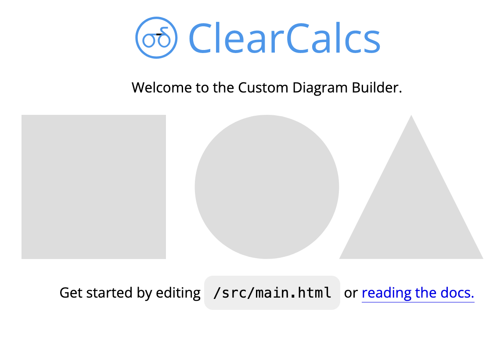
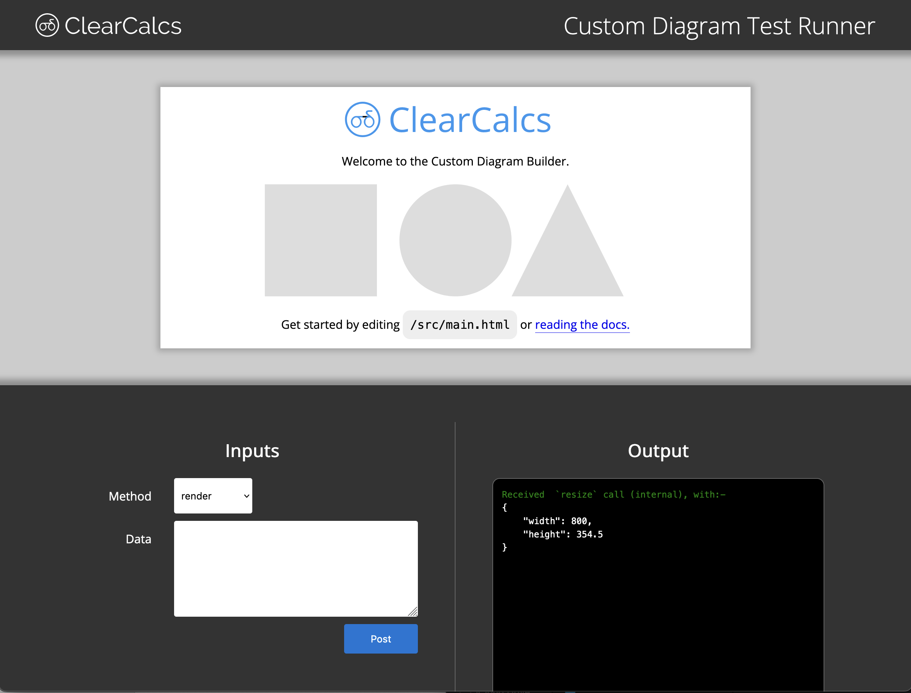

# Quick Start Guide

## Introduction

Custom Diagrams is a powerful method of plugging in rich visualisations into ClearCalcs calculators. They deliver a full-featured HTML, CSS and Javascript environment to develop engineering drawings, diagrams graphs, or even interactive experiences such as maps or CAD viewers. Custom diagrams fully take advantage of the tight integration with the live calculation engine of ClearCalcs.

Try out one of our diagrams inside a real-world calculator below. Change one of the "Bolt Pattern Coordinates" and watch the diagram update.

<div style="text-align: center;">

[Click to Go to Interactive Example](https://clearcalcs.com/embed/steelBoltAnalysisFree/8d313ffc-6145-42a0-a86d-dddac98aa136?suppressLogo=1 ":include :type=iframe width=450px height=500px")

</div>

## Choosing Diagram Type

Diagrams come in two different forms, interactive and static. Static are simpler SVGs that can be used for general diagrams where there is no need for user interactivity. Interactive diagrams are more advanced full HTML iframes that can also send values back out into the calculator, but cannot be used in print. Both types re-render in response to changes made in the sheet.

?> You can use Interactive & Static diagrams separately or combine together for the best experience!

| Feature               | Interactive | Static |
| --------------------- | ----------- | ------ |
| Render in Sheet       | ✅          | ✅     |
| Render in Print       |             | ✅     |
| SVG                   | ✅          | ✅     |
| JS/TS (incl bundling) | ✅          | ✅     |
| Full HTML             | ✅          |        |
| User interaction      | ✅          |        |

To start making your own custom diagram, follow the simple setup guide to start developing.

## Installation

1. Download [Source Code interactive](https://github.com/ClearCalcs/custom-diagram-boilerplate/archive/refs/heads/main.zip) or Source Code Static ([contact ClearCalcs for link](mailto:support@clearcalcs.com)) and unzip it. Alternatively, you can clone it from our [GitHub](https://github.com/ClearCalcs/custom-diagram-boilerplate).
2. NodeJS (version 19 or newer) _[https://nodejs.org/en/download/package-manager](https://nodejs.org/en/download/package-manager)_
3. In your terminal navigate into the folder containing the code

```
cd path/to/repository/folder
```

3. Install NodeJS dependencies

```
npm install
```

## Local Testing: Interactive

### Starting the Development Server

For developing your widget, you can start a web server that will automatically update as you make code changes, by running:

```
npm start
```

?> Once you see `Server running at http://localhost:1234` in your terminal, you'll know the server is running.

This will start a server at [http://localhost:1234](http://localhost:1234), you can open this link in your browser to see your widget running. You should see something like this:



While this server is running, any code changes you make will automatically be updated in the browser. See [Building your widget](/quick-start-guide?id=developing) for more information on how to start building a widget.

### Starting the Test Runner

With the development server running, you can start the Test Runner. This will allow you to run your diagram in an environment that simulates the communication your widget will have with the ClearCalcs platform. In a new terminal or terminal tab at the folder of your code, run:

```
npm test
```

?> Once you see `Server running at http://localhost:4321` in your terminal, you'll know the test runner is running.

This will start another server [http://localhost:4321](http://localhost:4321), you can open this link in your browser to see the Test Runner. You should see the following, with your diagram in the box at the box at the top.



The Test Runner will also update automatically with your code changes while it's running. See [Using the Test Runner](/interactive-diagram-test-runner) for more information on how get the most out of the test runner.

### Compilation

Once happy with changes, compile into a single html file at `output/index.html`.

```
npm run-script compile
```

## Local Testing: Static

### Compilation

While developing your static diagram widget, you'll need to generate a compiled file first before testing rendering or params locally. This should be run initially or whenever code changes.

```
npm run compile
```

#### Testing render

1. Update the `tester/test.js` => `inputParams` with the parameter values the diagram expects.

```javascript
const inputParams = {
    circleFill: "red",
    rectFill: "blue",
};
```

2. Generate an SVG file. Output will be placed in `tester/out/diagram.svg`

```bash
npm run test-render
```

#### Testing params

1. Generate params. Output will be logged to the console and also saved into `tester/out/params.json`

```bash
npm run test-params
```

## Developing

With the html file and javascript file below, we create a diagram with 2 simple shapes. This diagram can be embedded into a calculator using the calculator builder, and the parameters `circleFill` and `rectFill` can be wired up to other inputs or equations.

src/main.html

-   [Source Code (interactive)](https://github.com/ClearCalcs/custom-diagram-boilerplate/blob/main/src/main.html)
-   Source Code (static) - [contact ClearCalcs for link](mailto:support@clearcalcs.com)

```html
<svg id="svg" viewBox="0 0 500 100">
    <circle id="circle" cx="250" cy="50" r="50" fill="#ddd" />
    <rect id="rect" x="80" y="0" width="100" height="100" fill="#ddd" />
</svg>
```

src/interface.ts

-   [Source Code (interactive)](https://github.com/ClearCalcs/custom-diagram-boilerplate/blob/main/src/interface.ts)
-   Source Code (static) - [contact ClearCalcs for link](mailto:support@clearcalcs.com)

For static diagram changes to `render`, see [Static Diagram Usage](/static-diagram-core?id=usage)

```javascript
export async function initialize() {} // interactive only

export async function render(params) {
    if (!!params.circleFill) {
        document
            .getElementById("circle")
            ?.setAttribute("fill", params.circleFill);
    }

    if (!!params.rectFill) {
        document.getElementById("rect")?.setAttribute("fill", params.rectFill);
    }
}

export async function params() {
    return [
        { key: "circleFill", type: "string" },
        { key: "rectFill", type: "string" },
    ];
}
```

On every change of the above parameters, the `render()` function is invoked automatically, causing the shapes' fill colours to be updated in sheet view (and print if using static diagram). `params()` is invoked only when the calculation is first built, to identify the parameters the diagram expects to react to changing values. `initialize()` will run whenever diagram is first loaded. Use this to initialize any variables event handlers before any render or params calls come in.

A detailed explanation of how diagrams are used in the ClearCalcs platform is available at [Using in ClearCalcs](/using-in-clearcalcs?id=using-in-clearcalcs "How diagrams are used inside ClearCalcs calculators")
