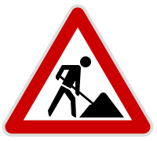

# Global Capabilities

The Custom Diagram engine has several time saving features that will be directly built into both interactive as well as static diagrams to give you more out of the box capability e.g. Zoom, panning, lightbox. These powerful time savers can be toggled on or off, and do not need to be custom-built.

## Zoom & Pan

Zoom in or pan around any part of the diagram. Diagrams should be developed to scale effectively to larger viewports to take full advantage of this upcoming feature.

This feature is still in development.

## Lightbox

The diagram is rendered in a larger window on the user's browser where toggled by the user. Diagrams should be developed to scale effectively to larger viewports i.e. do not use fixed `height` `width` properties on the SVG.

This feature is still in development.
