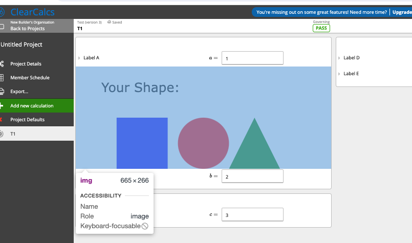
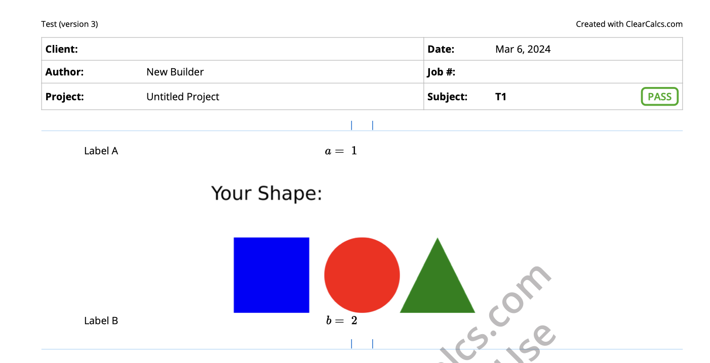
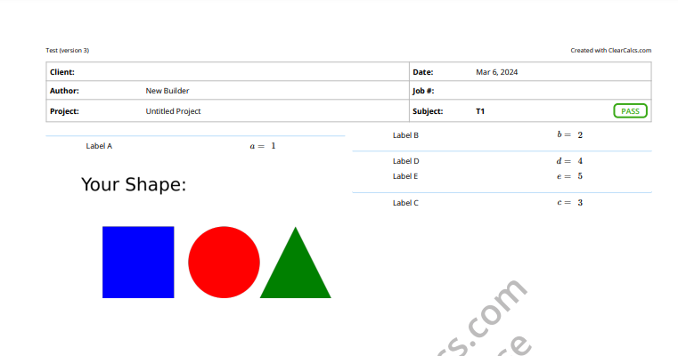
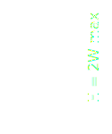

# Rendering

The custom diagram is rendered in 3 distinct arrangements:

-   Sheet View
-   One-Page print mode
-   Standard print mode

?> The size, position and aspect ratio are controlled by the SVG `viewBox` property on the root SVG element. Do not use `height` or `width` properties, as content may be rendered incorrectly or cut-off.

## Size and Position

### Sheet View

|           |                              |
| --------- | ---------------------------- |
| Width     | Column Width (380 to 800 px) |
| Height    | Preserves aspect ratio       |
| Margins   | 0px                          |
| Centering | None                         |
| Format    | SVG                          |

### Standard Print

|            |                                         |
| ---------- | --------------------------------------- |
| Width      | Equal to half page width (A4 or Letter) |
| Height     | Preserves aspect ratio                  |
| Margins    | 1/4 page width                          |
| Centering  | Yes                                     |
| Format     | PNG                                     |
| Resolution | 800px W (fixed)   1600px H (max)     |

### One Page Print

|            |                                     |
| ---------- | ----------------------------------- |
| Width      | Column Width                        |
| Height     | Preserves aspect ratio              |
| Margins    | 0px                                 |
| Centering  | Yes                                 |
| Format     | PNG                                 |
| Resolution | 800px W (fixed)   1600px H (max) |

## Aspect Ratio

The aspect ratio should be limited where the height shall not exceed twice the width. Taller aspect ratio will be rendered in the sheet, but will get cut off in print.

## Language Restrictions / sandboxing

Custom diagram should be restricted to use features for the environment it is used for. i.e. sheet and print modes, or just print mode where an interactive diagram is also used.

### Sheet View

The SVG is rendered inside an `` tag, which has specific browser restrictions which include but are not limited to:

-   No client-side javascript (e.g. no buttons, event listeners)
-   No external resources (e.g. images, stylesheets). In future may allow via ES Build bundling.

See W3 SVG Security Page for details _[link](https://www.w3.org/wiki/SVG_Security#SVG_as_image)_

### Print View

The SVG is converted into a PNG image with the following settings using the Sharp library _[link](https://sharp.pixelplumbing.com/)_. The restrictions applied include but are not limited to:

-   no css variables `var()` _[link](https://gitlab.gnome.org/GNOME/librsvg/-/issues/459)_
-   no css property `dominant-baseline`
-   no embedded fonts _[link](https://gitlab.gnome.org/GNOME/librsvg/-/issues/153)_

See Sharp documentation or library librsvg (used under the hood) for details _[link](https://wiki.gnome.org/Projects/LibRsvg)_
