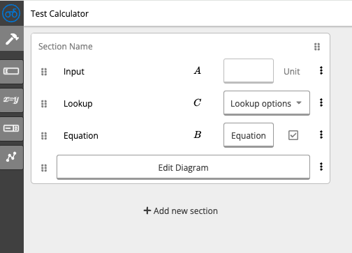
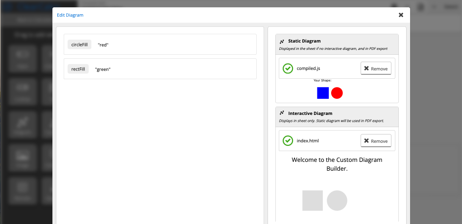

# Using in ClearCalcs

ClearCalcs is a platform for structural engineers to use calculators to design safe structures such as buildings and civil infrastructure.

Find out more by visiting [https://clearcalcs.com/](https://clearcalcs.com/).

## Sign Up

To work with a custom diagram inside of ClearCalcs, you will need to sign up for a free account and request access to the builder.

1. Sign up via [https://clearcalcs.com/signup](https://clearcalcs.com/signup)
2. Request access to builder by contacting [support@clearcalcs.com](mailto:support@clearcalcs.com)
3. Once confirmed, you will see a "Calculator Builder" icon in the sidebar when you log in.

## Building Calculators

### Introduction

The builder is a web-based calculator creator. All ClearCalcs calculators are added and updated regularly via the builder (for examples see [Free Engineering Tools](https://clearcalcs.com/freetools)). Each calculator is built out of individual widgets such as:

-   **Input** displays a text box accepting user input
-   **Computed** displays a label with the results of maths equations
-   **Diagram** rendering a diagram created based on this guide.

### Building

1. Drag some widgets for anything the diagram will need to accept via render params. For more details about each widget type and how they can be used, see [Builder Quick Start Guide](https://app.clickup.com/6927027/v/dc/6kcnk-1766/6kcnk-147976)
2. Drag a Diagram widget and click on the "Edit Diagram" button

3. Upload `output/index.html` (interactive diagram) and/or `dist/compiled.js` (static diagram) into the ClearCalcs builder.
4. Add values or references to other sheet widgets against each parameter

5. Click Preview (top-right)
6. See the diagram reacting when other widgets are changed

### Publishing

ClearCalcs staff publish calculators created in the builder for use by all paying customers. It is also possible to publish calculators only usable in your organisation via the builder.

See guide to publishing:

[Calculator Publishing](https://doc.clickup.com/6927027/p/h/6kcnk-147776/9ba20c422155161)

## Using Calculators

Calculators that are published can be accessed in your project. For a quick guide on how to use, see:

[Getting Started 3 Simple Steps](https://clearcalcs.com/support/get-started-with-clearcalcs/getting-started-3-simple-steps-for-success)

The calculators may be exported to PDF to verify that the diagram correctly renders.

[Exporting Calculations](https://clearcalcs.com/support/get-started-with-clearcalcs/exporting-calculations-and-member-schedule)
